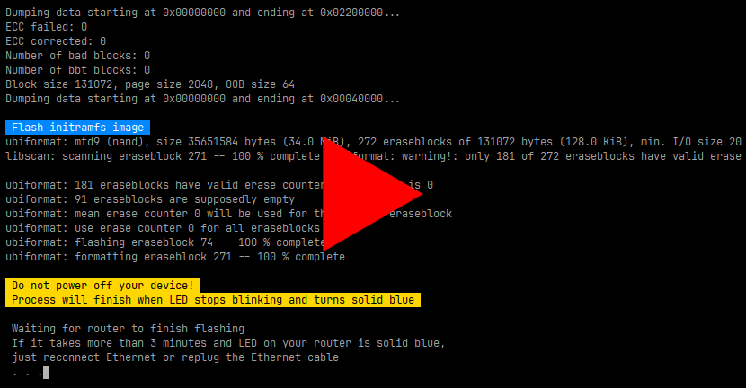

<p align="right"><a href="..#readme">English</a> | Русский</p>


### Установщик OpenWRT для Xiaomi AX3000T

Установщик автоматизирует [инструкции по установке из документации OpenWRT](https://openwrt.org/inbox/toh/xiaomi/ax3000t#installation), часть кода напрямую заимствована оттуда.

Работает на Linux. На Windows можно запустить, используя подсистему Windows для Linux (WSL) или виртуальную машину.

[Видео, ⏱️ 2 мин.](https://youtu.be/FMnWNaDLeDU)

[](https://youtu.be/FMnWNaDLeDU)


### Использование

0. [Загрузите OpenWRT](https://firmware-selector.openwrt.org/?target=mediatek/filogic&id=xiaomi_mi-router-ax3000t): файлы `initramfs-factory` и `sysupgrade`

1. Загрузите этот установщик в ту же папку:

    ```sh
    wget https://github.com/shvchk/openwrt-installer-ax3000t/raw/main/flash.sh
    ```

2. Отключитесь от текущей сети

3. Включите Xiaomi AX3000T

    Он должен быть соединён с компьютером Ethernet кабелем

4. Проверьте скрипт, затем запустите его:

    ```sh
    bash flash.sh
    ```
